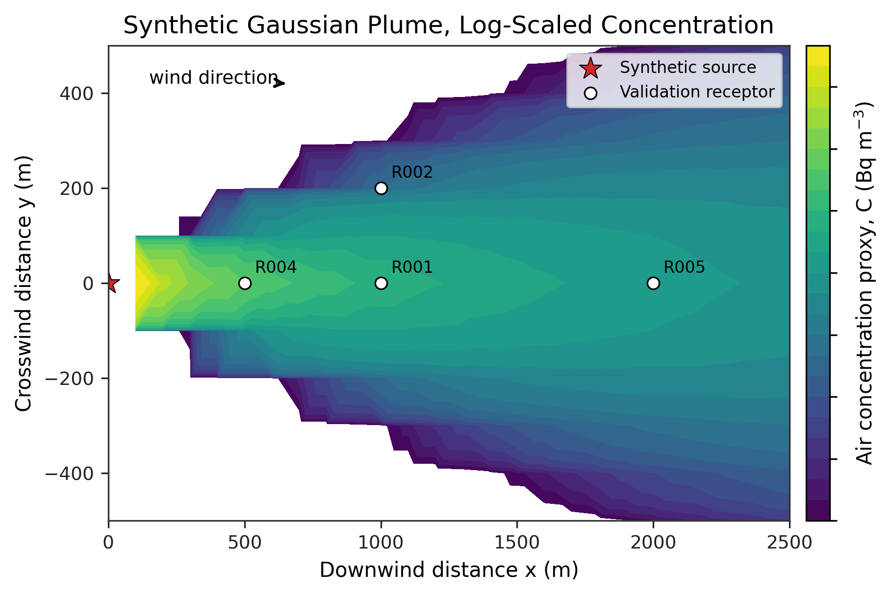
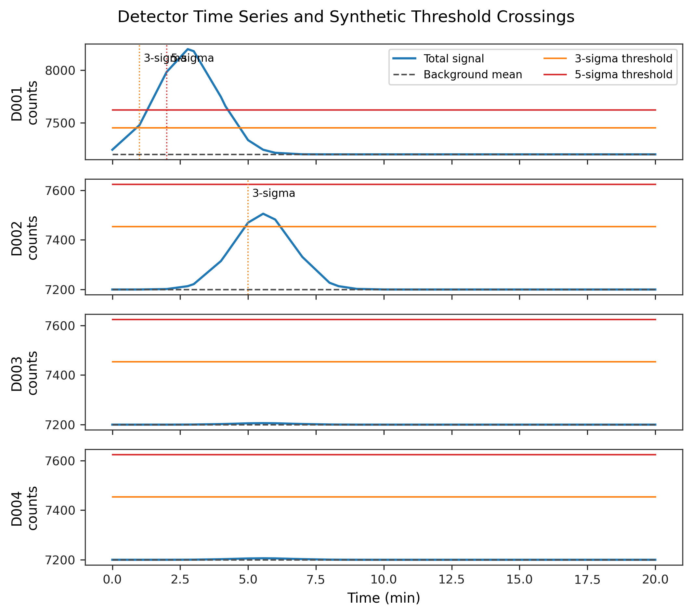
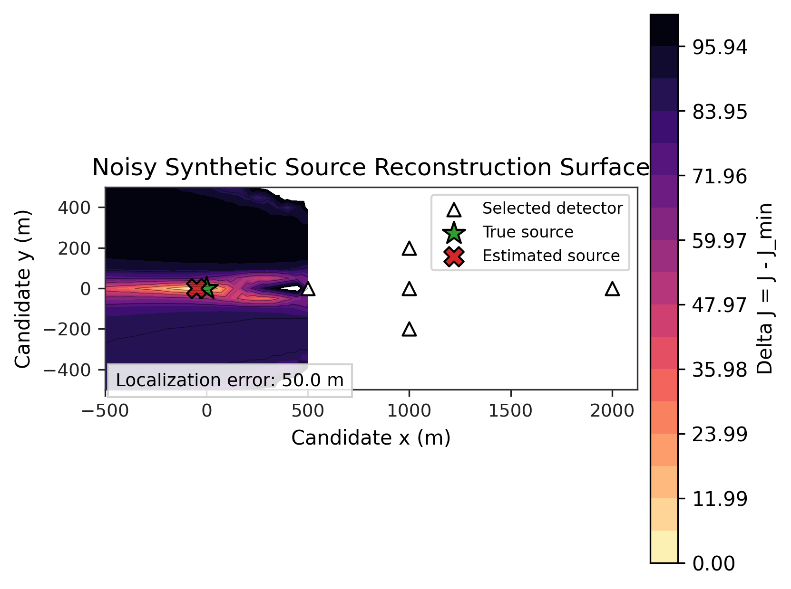
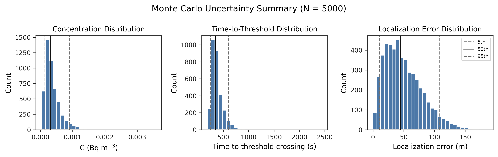

# Synthetic Radiological Plume Modeling and Sensor Network Analysis

A reproducible Python/MATLAB modeling package for synthetic Gaussian plume calculations, detector response simulation, sensor-network comparison, source reconstruction, and uncertainty analysis in a public Richland-area coordinate domain.

This repository uses synthetic source terms, detector locations, meteorology, and coordinate systems to demonstrate a reproducible plume/sensor-network modeling workflow. The outputs are computational examples for model development, visualization, uncertainty analysis, and source-reconstruction testing.

This is a synthetic modeling project, not an operational emergency-response tool, deployment recommendation, or real event reconstruction.

## Key idea

A plume/sensor-network workflow connects several modeling layers: source assumptions, transport behavior, detector response, threshold crossing, network layout, inverse reconstruction, sensitivity analysis, and uncertainty quantification.

The value of the project is not a single output figure. The value is the full reproducible pipeline: synthetic inputs, regenerated outputs, testable scripts, final figures, report tables, and documented assumptions.

## Selected figures

The plume contour figure shows the synthetic concentration field used as the basis for downstream detector and network calculations.



The detector time-series figure shows how synthetic detector response evolves relative to threshold behavior.



The source-reconstruction likelihood figure shows the inverse-modeling component of the workflow.



The Monte Carlo uncertainty summary shows how repeated sampled runs summarize uncertainty rather than relying on one deterministic result.



## What this repository demonstrates

- Synthetic Gaussian plume modeling
- Detector response simulation
- Threshold-crossing analysis
- Sensor-network comparison
- Source-reconstruction testing
- Sensitivity analysis
- Monte Carlo uncertainty analysis
- Python/MATLAB figure generation
- Reproducible outputs, report tables, and audit manifests
- Unit, integration, output, and data sanity tests

## Repository structure

- `config/` - assumptions and run configuration.
- `data/synthetic/` - generated synthetic input CSVs.
- `data/processed/` - regenerated computational outputs.
- `src/` - plume, detector, network, reconstruction, sensitivity, Monte Carlo, plotting, and report-table modules.
- `scripts/` - ordered pipeline entry points.
- `matlab/` - MATLAB helpers for reading exported CSVs and regenerating figures.
- `figures/` - final review figures in PDF and PNG.
- `report/tables/` - generated report-ready CSV tables.
- `docs/` - figure and bibliography audit manifests.
- `tests/` - unit, integration, output, and data sanity tests.

## Setup

Use Python 3.11.

```bash
python -m venv .venv
source .venv/bin/activate
python -m pip install -r requirements.txt
```

Windows PowerShell:

```powershell
py -3.11 -m venv .venv
.\.venv\Scripts\Activate.ps1
python -m pip install -r requirements.txt
```

## Build commands

Run the full pipeline from the repository root:

```bash
make all
```

On Windows, GNU Make may be available as `gmake`:

```powershell
gmake all PYTHON=.\.venv\Scripts\python.exe
```

Other useful targets:

```bash
make clean
make figures
make test
```

Equivalent script sequence:

Use `make all` for the full build. Individual scripts can also be run from `scripts/` in numeric order. The final Monte Carlo command is:

```bash
python scripts/07_run_monte_carlo.py --n-samples 5000 --run-name final
```

## Expected outputs

The build regenerates:

- Plume receptor, grid, profile, dispersion, and puff CSVs under `data/processed/plume_outputs/`
- Detector time-series and threshold-crossing CSVs under `data/processed/detector_outputs/`
- Network metric and detector-map CSVs under `data/processed/network_outputs/`
- Source-reconstruction likelihood and estimate CSVs under `data/processed/source_reconstruction_outputs/`
- Sensitivity and Monte Carlo CSVs under `data/processed/sensitivity_outputs/` and `data/processed/monte_carlo_outputs/`
- MATLAB-ready CSVs under `data/processed/matlab_exports/`
- Final figures under `figures/`
- Report tables under `report/tables/`
- Manifests under `docs/figure_manifest.md`, `figures/figure_manifest.csv`, and `docs/bibliography_audit.md`

## Figure outputs

Final figure basenames include:

- `plume_log_contour`
- `centerline_profile`
- `crosswind_profile`
- `detector_timeseries`
- `network_metrics`
- `detection_probability_by_network`
- `src_recon_likelihood`
- `src_recon_error_dist`
- `sensitivity_tornado`
- `mc_conc_dist`
- `mc_ttd_dist`
- `mc_loc_error_dist`
- `mc_uncertainty_summary`

Each is written as PDF and PNG in `figures/`.

## Methods demonstrated

- Gaussian plume-style synthetic transport modeling
- Detector threshold and response simulation
- Sensor-network metric comparison
- Source-reconstruction likelihood mapping
- Monte Carlo uncertainty analysis
- Sensitivity analysis
- Python pipeline orchestration
- MATLAB/Python figure generation
- Reproducible CSV output generation
- Test-driven output verification

## Report status

The repository currently freezes the computational pipeline, generated tables, and figure outputs. The final report will be written from these frozen outputs.

## Tests

Run the test suite with:

```bash
python -m pytest -q
```

The output file `test_run_output.txt` records the latest test run result.

## Limitations

This repository uses synthetic inputs and simplified modeling assumptions. It does not represent real source localization, real detector deployment, emergency guidance, official radiological assessment, or operational plume forecasting.

The model does not replace site-specific meteorology, calibrated detector response, emergency-management procedures, regulatory analysis, or professional radiological assessment. It is a controlled computational project for demonstrating plume modeling, detector response, sensor-network comparison, source-reconstruction testing, and uncertainty analysis.

## License

See `LICENSE`.
